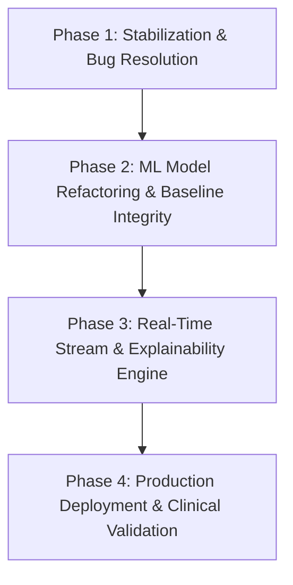

# Wearable Health AI — Comprehensive Analysis, Flaws, Bug Solutions, & Technical Roadmap

## Executive Summary
This document provides a thorough audit of the **Wearable Health AI / Wearable Health Intelligence** project. It outlines the core architectural and Machine Learning (ML) flaws, details existing and potential runtime bugs/errors with exact solutions, and sets forth a step-by-step roadmap and approach for production readiness, scalability, and scientific validity.

---

## 1. Comprehensive Analysis of Flaws (ML & System Architecture)

### A. Machine Learning & Statistical Modeling Flaws

1. **Rule-Based Overriding of ML Clustering (`_infer_state` Hardcoded Thresholds)**
   - **Problem**: GMM and KMeans cluster continuous physiological features (`hr_dev`, `hrv_dev`, `sleep_dev`, `severity_score`). However, cluster-to-state mapping (`Recovery`, `Baseline`, `Strain`) in `src/gmm.py` and `src/kmeans.py` relies on hardcoded absolute thresholds:
     ```python
     def _infer_state(hrv: float, hr: float, sleep_hours: float) -> str:
         if hrv > 60 and hr < 65 and sleep_hours >= 7: return "Recovery"
         if hrv < 40 and hr > 70: return "Strain"
         return "Baseline"
     ```
   - **Why it's a flaw**: This defeats the core value proposition of personal baseline normalization. If an individual has a baseline HRV of 30 ms (common in older demographics or specific physiological profiles), `hrv > 60` will never trigger, forcing all clusters to be labeled `Baseline` or `Strain`.
   - **Collision Risk**: Multiple clusters often get assigned the exact same label (e.g., both Cluster 0 and Cluster 1 assigned to `Baseline`), creating state collisions, overwriting state probability dictionaries, and zeroing out state distributions.

2. **Inappropriate Model Choice & Input Formatting for Hidden Markov Model (HMM)**
   - **Problem**: `src/hmm_model.py` uses `GaussianHMM` on smoothed one-hot encoded cluster vectors (`prepare_observation_vectors`).
   - **Why it's a flaw**: Fitting continuous Gaussian distributions on bounded, sparse one-hot dummy variables ($[0, 1]$) causes degenerate covariance matrices and likelihood instabilities (hence requiring artificial `min_covar=1e-3` variance padding).
   - **Better Approach**: Either use `CategoricalHMM` / `MultinomialHMM` for discrete cluster sequences or fit `GaussianHMM` directly on the continuous scaled physiological feature matrix (`scaled_cluster_df`).

3. **In-Sample Fitting & Lack of Model Persistence (Data Leakage during Inference)**
   - **Problem**: In `run_inference.py`, `StandardScaler()`, `GaussianMixture`, `KMeans`, and `GaussianHMM` are fit from scratch on the incoming single-user or uploaded dataset slice via `fit_transform` and `fit`.
   - **Why it's a flaw**: The `.pkl` files in `models/` (`gmm.pkl`, `kmeans.pkl`, `hmm.pkl`) are 1-byte empty placeholder files. Re-fitting models per request leads to inconsistent cluster boundaries across runs, data leakage across time windows, and inability to evaluate model performance against a fixed benchmark.

4. **Data Leakage in Data Preprocessing Pipeline**
   - **Problem**: `remove_outliers` computes IQR quantiles (`q1`, `q3`) across the entire user timeline at once (`df.groupby("user_id")[column].transform(...)`). `handle_missing` uses `limit_direction="both"` linear interpolation and `bfill()`.
   - **Why it's a flaw**: Future observations leak into past time steps, violating strictly temporal causality required for real-time wearable streaming data.

5. **Surrogate Model SHAP Explainability Disconnect**
   - **Problem**: In `app/dashboard_utils.py`, `compute_explainability` fits a brand-new `RandomForestClassifier` on `feature_columns` to predict cluster labels, then runs `shap.TreeExplainer` or `permutation_importance` on that Random Forest.
   - **Why it's a flaw**: The UI claims to explain the GMM/HMM health state prediction, but it is actually explaining an unvalidated surrogate Random Forest model.

6. **Hardcoded What-If Simulation**
   - **Problem**: `render_what_if_simulation` in `app/main.py` recalculates state using the rule-based `_infer_state` heuristic rather than feeding modified inputs through the fitted GMM/KMeans and HMM pipelines.

---

## 2. Potential Bugs, Errors & Edge Cases

| Bug / Vulnerability | Location | Description & Root Cause | Severity |
| :--- | :--- | :--- | :--- |
| **Corrupt 1-Byte Model Load Crash** | `models/*.pkl`, `src/clustering.py`, `src/hmm_model.py` | `models/gmm.pkl`, `kmeans.pkl`, `hmm.pkl` are 1-byte files (`\n`). Calling `joblib.load()` passes the `st_size > 0` check but throws `_pickle.UnpicklingError`. | **High** |
| **`NaN` Propagation in Streamlit UI** | `src/risk_scoring.py`, `app/main.py` | If uploaded CSV has missing/un-filled optional columns, `compute_health_risk_intelligence` produces `NaN`. `st.progress(NaN)` throws `ValueError: cannot convert float NaN to integer`. | **High** |
| **Legacy Schema Incompatibility** | `src/baseline.py`, `src/features.py` | Legacy helper files reference old schema (`heart_rate`, `sleep_hours`, `spo2`, `stress_level`). Running legacy data through main pipeline raises `KeyError`. | **Medium** |
| **Risk Monotonicity Index Error** | `src/kmeans.py`, `src/gmm.py` | If cluster labels contain values outside `["Recovery", "Baseline", "Strain"]` or fewer than 2 clusters exist, severity reindexing fails or returns false positive monotonicity. | **Medium** |
| **Synchronous Network Latency** | `src/environment.py` | `urlopen` is called synchronously in `get_environment(city)` with a 10s timeout. If `OPENWEATHER_API_KEY` is invalid or network is blocked, dashboard lags by 10s. | **Medium** |
| **Single-Row Dataset Crash** | `src/preprocessing.py` | If uploaded dataset has 1 row per user, `rolling_slope` and `std` produce empty or zero variances, resulting in `0/0` (`NaN`) division in `hrv_cv_7d`. | **Medium** |

---

## 3. Detailed Solutions & Code Implementation Plan

### Solution 1: Relative Quantile Cluster Labeling
Replace hardcoded `_infer_state` thresholds in `gmm.py` and `kmeans.py` with relative cluster centroid ranking based on `severity_score` or z-score deviation vectors:
```python
def assign_relative_state_labels(cluster_summary: pd.DataFrame, cluster_column: str) -> dict[int, str]:
    # Rank clusters by mean severity score
    sorted_clusters = cluster_summary.sort_values("severity_score").reset_index(drop=True)
    n_clusters = len(sorted_clusters)
    
    state_map = {}
    if n_clusters == 3:
        states = ["Recovery", "Baseline", "Strain"]
    elif n_clusters == 2:
        states = ["Recovery", "Strain"]
    else:
        # Dynamic quantiles for K > 3
        states = [f"State_{i}" for i in range(n_clusters)]
        
    for idx, row in sorted_clusters.iterrows():
        cluster_id = int(row[cluster_column])
        state_map[cluster_id] = states[idx]
    return state_map
```

### Solution 2: Transition to `CategoricalHMM` or Direct Continuous HMM
Update `src/hmm_model.py` to use `CategoricalHMM` for cluster state sequences or train a continuous `GaussianHMM` directly on `scaled_cluster_df`:
```python
from hmmlearn.hmm import CategoricalHMM

def train_categorical_hmm(cluster_sequences: list[np.ndarray], n_states: int = 3):
    model = CategoricalHMM(n_components=n_states, n_iter=200, random_state=42)
    # Fit directly on integer discrete state sequences
    model.fit(X=np.concatenate(cluster_sequences), lengths=[len(s) for s in cluster_sequences])
    return model
```

### Solution 3: Proper Model Serialization & Model Artifact Generator
Create a dedicated offline training script (`train_and_save_models.py`) that trains models on benchmark dataset `wearables_health_6mo_daily.csv` and dumps valid binary `.pkl` files using `joblib.dump()`.

### Solution 4: Strict Preprocessing Causal Isolation
Update `handle_missing` and `remove_outliers` in `src/preprocessing.py` to use forward-only operations (`ffill()` only, expand-window or rolling quantiles) to eliminate temporal data leakage.

### Solution 5: Safe `NaN` Handling in UI & Risk Intelligence
Ensure `_clamp_pct` and risk score functions sanitize `NaN` and `Inf` inputs using `np.nan_to_num()`:
```python
def _clamp_pct(value: float, default: float = 0.0) -> float:
    if pd.isna(value) or np.isinf(value):
        return default
    return float(round(max(0.0, min(100.0, value)), 1))
```

---

## 4. Further Technical Roadmap & Phase-Wise Approach



### Phase 1: Immediate Stabilization & Bug Resolution (Weeks 1 – 2)
- **Goal**: Eliminate crashes, fix corrupt pickles, and ensure 100% test coverage for pipeline routines.
- **Tasks**:
  1. Generate non-empty, binary pre-trained `.pkl` model files for GMM, KMeans, and HMM.
  2. Implement defensive NaN/Inf sanitization across all metric calculations, Streamlit progress bars, and risk scoring routines.
  3. Deprecate or harmonize legacy schema functions in `baseline.py` and `features.py` with `preprocessing.py`.
  4. Add asynchronous/cached wrappers around `get_environment()` using `@st.cache_data(ttl=1800)`.

### Phase 2: ML Pipeline & Modeling Refactoring (Weeks 3 – 5)
- **Goal**: Replace rule-based heuristics with scientifically rigorous, personalized machine learning.
- **Tasks**:
  1. Replace `_infer_state` hardcoded thresholds with relative severity cluster mapping (`assign_relative_state_labels`).
  2. Refactor HMM to use `CategoricalHMM` on discrete state sequences or direct continuous `GaussianHMM` on multivariate physiological z-scores.
  3. Implement strict causal time-series preprocessing (forward-only fill, rolling baseline estimation without future leakage).
  4. Fix What-If simulation in UI to run dynamic inference through stored scaler and GMM/HMM objects.

### Phase 3: Advanced Explainability & Personalization Engine (Weeks 6 – 8)
- **Goal**: Enhance model interpretability and personal adaptive baselines.
- **Tasks**:
  1. Implement exact GMM posterior log-likelihood explainability (measuring Mahalanobis distance contribution per feature) replacing surrogate Random Forest.
  2. Introduce adaptive EWMA (Exponentially Weighted Moving Average) baselines alongside rolling 7-day windows to capture short-term vs long-term circadian adaptation.
  3. Add multi-user benchmarking and cohort analysis (age/gender normalized reference metrics).

### Phase 4: Production Deployment, API & MLOps (Weeks 9 – 12)
- **Goal**: Scale the project from a Streamlit prototype to an enterprise microservice architecture.
- **Tasks**:
  1. Decouple ML backend from Streamlit frontend using FastAPI RESTful endpoints (`/api/v1/predict`, `/api/v1/recommend`).
  2. Implement MLflow for model tracking, versioning, and performance monitoring.
  3. Package backend and frontend into Docker containers (`docker-compose.yml`).
  4. Add automated CI/CD unit testing and integration test suites using `pytest`.

---

## 5. Summary of Recommended Action Items

| Priority | Action Item | Target Component | Expected Outcome |
| :---: | :--- | :--- | :--- |
| **P0** | Overwrite dummy 1-byte `.pkl` files with actual trained binary models | `models/` | Prevents unpickling crash on startup |
| **P0** | Sanitize `NaN`/`Inf` inputs in risk intelligence & UI cards | `src/risk_scoring.py`, `app/main.py` | Prevents Streamlit progress bar crashes |
| **P1** | Replace `_infer_state` with dynamic severity ranking | `src/gmm.py`, `src/kmeans.py` | Restores personalized baseline modeling |
| **P1** | Switch HMM to `CategoricalHMM` | `src/hmm_model.py` | Eliminates continuous Gaussian violation on one-hot data |
| **P2** | Add Streamlit caching to OpenWeather API calls | `src/environment.py` | Reduces dashboard load time by up to 10s |
| **P2** | Connect What-If simulation to trained pipeline objects | `app/main.py` | Provides genuine interactive ML inference |
